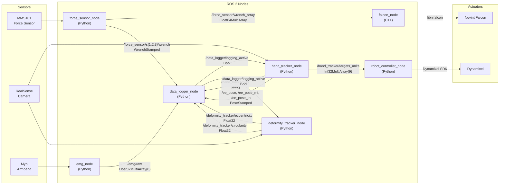
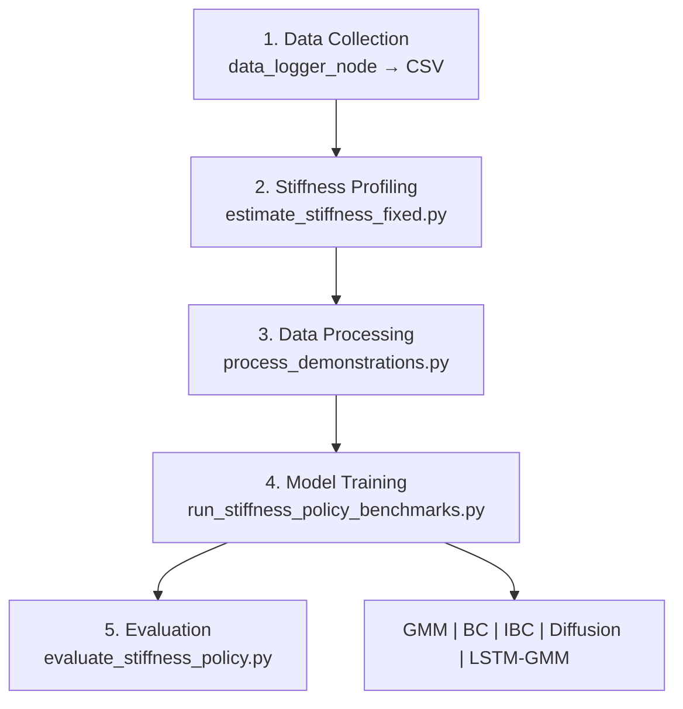

# hri_falcon_robot_bridge

**Two-Finger Haptic Teleoperation & Stiffness Policy Learning**

ROS 2 Humble 기반의 two-finger 햅틱 텔레오퍼레이션 시스템.
Force sensor → Falcon haptic feedback, Hand tracking → Dynamixel 제어, EMG 수집, 동기화 로깅, 임피던스 모방학습까지의 전체 파이프라인을 포함합니다.

---

## Demo

<table>
<tr>
<td align="center"><b>전체 워크플로우</b></td>
<td align="center"><b>실사용 데모</b></td>
</tr>
<tr>
<td>

https://github.com/user-attachments/assets/43df6547-e6d0-461a-83b5-1941b37cc7fa

</td>
<td>

https://github.com/user-attachments/assets/992dd69d-993f-4229-9640-c16b96fcf0a4

</td>
</tr>
</table>

---

## System Architecture




---

## ROS 2 Nodes

### Node-Topic 상세

| Node | Pub Topics | Sub Topics |
|------|-----------|------------|
| **force_sensor_node** (Python) | `/force_sensor/wrench_array` (Float64MultiArray)<br/>`/force_sensor/s{1,2,3}/wrench` (WrenchStamped) | — |
| **falcon_node** (C++) | — | `/force_sensor/wrench_array` (Float64MultiArray) |
| **hand_tracker_node** (Python) | `/hand_tracker/targets_units` (Int32MultiArray)<br/>`/hand_tracker/joint_states` (JointState)<br/>`/hand_tracker/key` (String)<br/>`/ee_pose` `/ee_pose_mf` `/ee_pose_th` (PoseStamped) | `/data_logger/logging_active` (Bool) |
| **robot_controller_node** (Python) | — | `/hand_tracker/targets_units` (Int32MultiArray) |
| **deformity_tracker_node** (Python) | `/deformity_tracker/circularity` (Float32)<br/>`/deformity_tracker/eccentricity` (Float32) | `/data_logger/logging_active` (Bool) |
| **emg_node** (Python) | `/emg/raw` (Float32MultiArray)<br/>`/hand_tracker/key` (String) | — |
| **data_logger_node** (Python) | `/data_logger/logging_active` (Bool) | `/force_sensor/s2/wrench`, `/force_sensor/s3/wrench` (WrenchStamped)<br/>`/deformity_tracker/circularity`, `/eccentricity` (Float32)<br/>`/emg/raw` (Float32MultiArray)<br/>`/ee_pose`, `/ee_pose_mf`, `/ee_pose_th` (PoseStamped)<br/>`/hand_tracker/key` (String) |

### data_logger_node 저장 데이터

| 그룹 | CSV 컬럼 |
|------|----------|
| Force Sensor (s2, s3) | `s2_fx`, `s2_fy`, `s2_fz`, `s2_tx`, `s2_ty`, `s2_tz`, `s3_fx` ... `s3_tz` |
| EE Pose (IF, MF, TH) | `ee_if_px`, `ee_if_py`, `ee_if_pz`, `ee_mf_px` ... `ee_th_pz` |
| Deformity | `deform_circ`, `deform_ecc` |
| EMG (8ch) | `emg_ch1` ~ `emg_ch8` |
| Timestamp | `t_sec`, `t_nanosec` |

> 로깅 ON/OFF: 키보드 `s` 키 토글 (`/hand_tracker/key`). CSV 저장 경로: `outputs/logs/YYYYMMDD/`

---

## Topics

```
/force_sensor/wrench_array       Float64MultiArray   (num_sensors × 6)
/force_sensor/s{1,2,3}/wrench    WrenchStamped
/hand_tracker/targets_units      Int32MultiArray     (9)
/hand_tracker/joint_states       JointState
/hand_tracker/key                String              ('s' = 로깅 토글)
/ee_pose                         PoseStamped         (IF finger)
/ee_pose_mf                      PoseStamped         (MF finger)
/ee_pose_th                      PoseStamped         (TH finger)
/deformity_tracker/circularity   Float32
/deformity_tracker/eccentricity  Float32
/emg/raw                         Float32MultiArray   (8ch)
/data_logger/logging_active      Bool
```

---

## Launch Files

| Launch | 설명 |
|--------|------|
| `bridge.launch.py` | Force sensor + Falcon 브릿지 |
| `haptic_system.launch.py` | Falcon + 연속 힘 테스트 |
| `robot_controller.launch.py` | Hand tracker + Dynamixel 제어 |

---

## Key Parameters

| Parameter | Node | 설명 |
|-----------|------|------|
| `publish_rate_hz` | force_sensor | 퍼블리시 주기 (default 100) |
| `use_mock` | force_sensor | 시뮬레이션 모드 |
| `safe_mode` | robot_controller | Dynamixel dry-run |
| `force_scale` | falcon | N → Falcon 변환 스케일 |
| `init_posture_enable` | falcon | 시작 시 PD 포스처 |
| `io_rate_hz` | falcon | 장치 IO 폴링 (default 1000) |
| `force_process_rate_hz` | falcon | 힘 적용 주기 (default 200) |
| `enable_plot` | emg | EMG 실시간 플롯 |
| `rate_hz` | data_logger | 로깅 주기 (default 100) |
| `csv_dir` | data_logger | CSV 저장 경로 |
| `ee_pose_topic` | hand_tracker / data_logger | EE pose 토픽 (default `/ee_pose`) |

---

## Installation

### Prerequisites

- Ubuntu 22.04
- ROS 2 Humble
- Python 3.10+

### Build

```bash
cd ~/ros2_ws/src
git clone https://github.com/songwookim/icra_2025_09_two_finger_version.git hri_falcon_robot_bridge

cd ~/ros2_ws
source /opt/ros/humble/setup.bash
colcon build --packages-select hri_falcon_robot_bridge
source install/setup.bash
```

---

## Pipeline Overview

### 전체 파이프라인



| 단계 | 스크립트 | 설명 |
|------|----------|------|
| **1. Data Collection** | `data_logger_node` | 시연 데이터 CSV 수집 |
| **2. Stiffness Profiling** | `scripts/estimate_stiffness_fixed.py` | Force 데이터에서 강성 프로파일 추출 |
| **3. Data Processing** | `scripts/process_demonstrations.py` | 시연 데이터 전처리 |
| **4. Model Learning** | `scripts/3_model_learning/` | 다양한 모델 학습 |
| **5. Evaluation** | `scripts/3_model_learning/evaluate_stiffness_policy.py` | 결과 비교 및 시각화 |

### 지원 모델

| Model | Type | 특징 |
|-------|------|------|
| **BC** | Behavior Cloning | MLP 기반 회귀, 기본 baseline |
| **Diffusion Policy** | Generative | DDPM/DDIM 기반 |
| **LSTM-GMM** | Sequence | 시계열 + GMM 출력 |
| **IBC** | Energy-based | Implicit Behavior Cloning |
| **GMR** | Probabilistic | Gaussian Mixture Regression |

### 모델 학습

```bash
python3 scripts/3_model_learning/run_stiffness_policy_benchmarks.py --seed 0 --tensorboard
```

### 모델 평가

```bash
python3 scripts/3_model_learning/evaluate_stiffness_policy.py --models all
```

모델별 하이퍼파라미터: `configs/stiffness_policy/*.yaml` 참고.

---

## DexMimicGen Pipeline

```bash
# CSV -> HDF5
python3 scripts/prepare_dexmimicgen_dataset.py outputs/logs/20250929/trial_*.csv \
    --output outputs/dexmimicgen/hard_mid.hdf5 --material hard

# 데이터 증강
python3 scripts/run_dexmimicgen_augmentation.py \
    --input outputs/dexmimicgen/hard_mid.hdf5 \
    --output outputs/dexmimicgen/hard_mid_aug.hdf5 \
    --backend auto --per-demo 200

# Diffusion Policy 학습
python3 scripts/diffusion_policy_full.py train --data-dir outputs/dexmimicgen/
```

---

## Directory Structure

```
hri_falcon_robot_bridge/
├── src/falcon_node.cpp            # C++ Falcon 노드
├── hri_falcon_robot_bridge/       # Python 노드 모듈
│   ├── force_sensor_node.py
│   ├── hand_tracker_node.py
│   ├── robot_controller_node.py
│   ├── deformity_tracker_node.py
│   ├── emg_node.py
│   ├── data_logger_node.py
│   ├── dynamixel_control.py
│   └── mms101_controller.py
├── launch/                        # ROS 2 launch 파일
├── resource/
│   ├── robot_parameter/           # Dynamixel 설정 YAML
│   └── sensor_parameter/          # Force sensor 설정 YAML
├── scripts/                       # 처리·학습·평가 스크립트
├── configs/stiffness_policy/      # 모델별 하이퍼파라미터
└── readme_files/                  # 이미지 및 영상
```

---

## Miscellaneous

### TensorBoard

```bash
tensorboard --logdir outputs/models/stiffness_policies/tensorboard --port 6006
```

### USB 레이턴시 최적화 (Dynamixel)

```bash
sudo sh -c 'echo 1 > /sys/bus/usb-serial/devices/ttyUSB0/latency_timer'
```

### 프로세스 강제 종료

```bash
pkill -9 -f "ros2|python3.*hri_falcon"
```

### VS Code Debug Configs

| # | 이름 | 설명 |
|---|------|------|
| 0 | Current Python File | 현재 파일 실행 |
| 1 | hand_tracker | RealSense + MediaPipe |
| 2 | force_sensor | 힘 센서 (use_mock:=false) |
| 3 | dclaw | Dynamixel (safe_mode:=false) |
| 4 | falcon | C++ gdb 디버그 |
| 5 | deformity_tracker | HSV 변형 추적 |
| 6 | emg_node | Myo EMG 8ch |
| 7 | data_logger | 동기화 CSV (100 Hz) |
| 8 | plot_result_csv | CSV 시각화 |

### C++ Build Notes

- `CMakeLists.txt`에서 로컬 `libnifalcon` 탐색 → 있으면 실제 장치 모드, 없으면 시뮬레이션
- RPATH 자동 설정 → `LD_LIBRARY_PATH` export 불필요

---

## License

MIT
