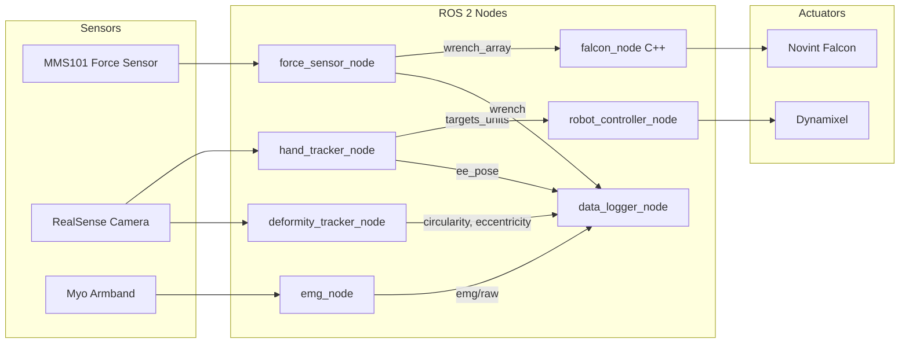
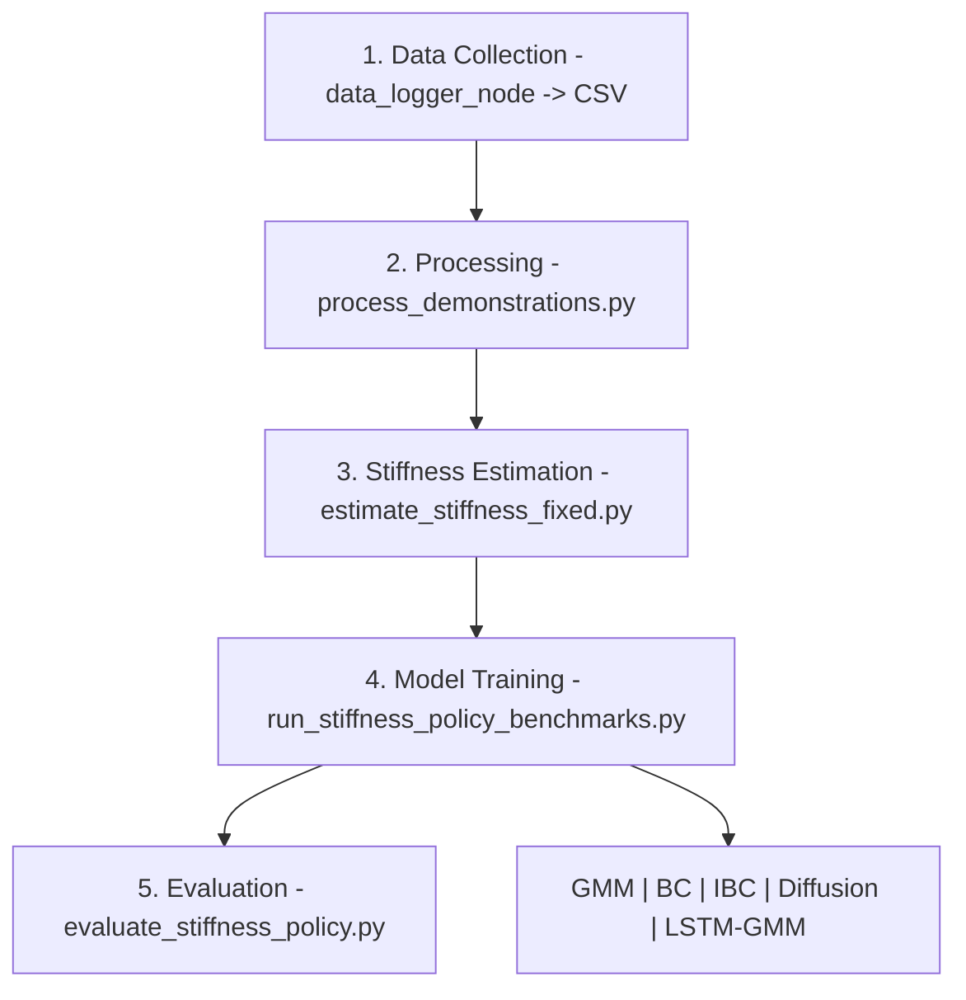

# hri_falcon_robot_bridge

Two-finger haptic teleoperation 시스템을 위한 ROS 2 Humble 패키지.
Force sensor → Falcon haptic feedback, Hand tracking → Dynamixel 제어, EMG 수집, 동기화 로깅, 임피던스 모방학습까지의 전체 파이프라인을 포함합니다.

---

## Demo

<table>
<tr>
<td align="center"><b>전체 워크플로우</b></td>
<td align="center"><b>실사용 데모</b></td>
</tr>
<tr>
<td>

https://github.com/user-attachments/assets/43df6547-e6d0-461a-83b5-1941b37cc7fa

</td>
<td>

https://github.com/user-attachments/assets/992dd69d-993f-4229-9640-c16b96fcf0a4

</td>
</tr>
</table>

---

## System Architecture




---

## Quick Start

```bash
# 빌드
source /opt/ros/humble/setup.bash
colcon build --packages-select hri_falcon_robot_bridge
source install/setup.bash

# 실행
ros2 launch hri_falcon_robot_bridge bridge.launch.py
```

VS Code에서는 Task **"colcon: build hri_falcon_robot_bridge (debug)"** 사용.

---

## Nodes

| Node | Lang | 역할 |
|------|------|------|
| `force_sensor_node` | Python | MMS101 힘 센서 → wrench 퍼블리시 |
| `falcon_node` | C++ | wrench 수신 → Falcon 힘 피드백 (libnifalcon) |
| `hand_tracker_node` | Python | RealSense + MediaPipe 손 추적 → 관절 타겟 |
| `robot_controller_node` | Python | 관절 타겟 → Dynamixel 모터 제어 |
| `deformity_tracker_node` | Python | RealSense + HSV → 변형 지표 |
| `emg_node` | Python | Myo armband → 8ch EMG 스트리밍 |
| `data_logger_node` | Python | 전 센서 동기화 CSV 로깅 (s 키로 토글) |

---

## Topics

```
/force_sensor/wrench_array      Float64MultiArray  (num_sensors x 6)
/force_sensor/s{i}/wrench       WrenchStamped
/hand_tracker/targets_units     Int32MultiArray    (9)
/hand_tracker/joint_states      JointState
/hand_tracker/key               String             (s = 로깅 토글)
/deformity_tracker/circularity  Float32
/deformity_tracker/eccentricity Float32
/emg/raw                        Float32MultiArray  (8ch)
/data_logger/logging_active     Bool
```

---

## Launch Files

| Launch | 설명 |
|--------|------|
| `bridge.launch.py` | Force sensor + Falcon 브릿지 |
| `haptic_system.launch.py` | Falcon + 연속 힘 테스트 |
| `robot_controller.launch.py` | Hand tracker + Dynamixel 제어 |

---

## Key Parameters

| Parameter | Node | 설명 |
|-----------|------|------|
| `publish_rate_hz` | force_sensor | 퍼블리시 주기 (default 100) |
| `use_mock` | force_sensor | 시뮬레이션 모드 |
| `safe_mode` | robot_controller | Dynamixel dry-run |
| `force_scale` | falcon | N → Falcon 변환 스케일 |
| `init_posture_enable` | falcon | 시작 시 PD 포스처 |
| `enable_plot` | emg | EMG 실시간 플롯 |
| `rate_hz` | data_logger | 로깅 주기 (default 100) |
| `csv_dir` | data_logger | CSV 저장 경로 |

---

## Learning Pipeline



### 모델 학습

```bash
python3 scripts/3_model_learning/run_stiffness_policy_benchmarks.py --seed 0 --tensorboard
```

### 모델 평가

```bash
python3 scripts/3_model_learning/evaluate_stiffness_policy.py --models all
```

### TensorBoard

```bash
tensorboard --logdir outputs/models/stiffness_policies/tensorboard --port 6006
```

모델별 하이퍼파라미터: `configs/stiffness_policy/*.yaml` 참고.

---

## DexMimicGen Pipeline

```bash
# CSV -> HDF5
python3 scripts/prepare_dexmimicgen_dataset.py outputs/logs/20250929/trial_*.csv \
    --output outputs/dexmimicgen/hard_mid.hdf5 --material hard

# 데이터 증강
python3 scripts/run_dexmimicgen_augmentation.py \
    --input outputs/dexmimicgen/hard_mid.hdf5 \
    --output outputs/dexmimicgen/hard_mid_aug.hdf5 \
    --backend auto --per-demo 200

# Diffusion Policy 학습
python3 scripts/diffusion_policy_full.py train --data-dir outputs/dexmimicgen/
```

---

## Directory Structure

```
hri_falcon_robot_bridge/
├── src/falcon_node.cpp            # C++ Falcon 노드
├── hri_falcon_robot_bridge/       # Python 노드 모듈
│   ├── force_sensor_node.py
│   ├── hand_tracker_node.py
│   ├── robot_controller_node.py
│   ├── deformity_tracker_node.py
│   ├── emg_node.py
│   ├── data_logger_node.py
│   ├── dynamixel_control.py
│   └── mms101_controller.py
├── launch/                        # ROS 2 launch 파일
├── resource/
│   ├── robot_parameter/           # Dynamixel 설정 YAML
│   └── sensor_parameter/          # Force sensor 설정 YAML
├── scripts/                       # 처리·학습·평가 스크립트
├── configs/stiffness_policy/      # 모델별 하이퍼파라미터
└── readme_files/                  # 이미지 및 영상
```

---

## VS Code Debug Configs

| # | 이름 | 설명 |
|---|------|------|
| 0 | Current Python File | 현재 파일 실행 |
| 1 | hand_tracker | RealSense + MediaPipe |
| 2 | force_sensor | 힘 센서 (use_mock:=false) |
| 3 | dclaw | Dynamixel (safe_mode:=false) |
| 4 | falcon | C++ gdb 디버그 |
| 5 | deformity_tracker | HSV 변형 추적 |
| 6 | emg_node | Myo EMG 8ch |
| 7 | data_logger | 동기화 CSV (100 Hz) |
| 8 | plot_result_csv | CSV 시각화 |

---

## C++ Build Notes

- `CMakeLists.txt`에서 로컬 `libnifalcon` 탐색 → 있으면 실제 장치 모드, 없으면 시뮬레이션
- RPATH 자동 설정 → `LD_LIBRARY_PATH` export 불필요

---

## License

MIT
